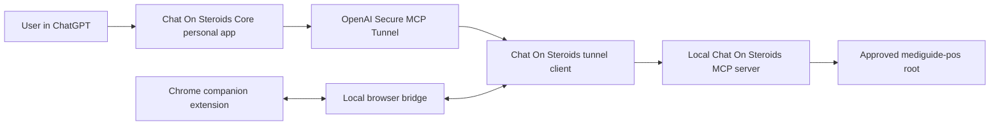

# Chat On Steroids, ChatGPT, and Codex integration runbook

## Purpose

This runbook documents the complete local integration that gives ChatGPT controlled access to the MediGuide monorepo through Chat On Steroids and OpenAI Secure MCP Tunnel. It also explains how this differs from using Codex in VS Code.

The configured repository is:

```text
/Users/jaba/Documents/projects/web/mediguide-pos
```

Do not put an API key, tunnel ID, connector technical ID, or the contents of `secrets.bin` in this repository, screenshots, issue reports, shell history, or chat messages.

## Verified state

The following state was verified on 24 September 2026:

| Component | Verified value |
| --- | --- |
| Chat On Steroids desktop app | `2.1.14`, Apple silicon (`arm64`) |
| Chrome companion extension | `2.1.14`, Manifest V3 |
| ChatGPT personal app | `Chat On Steroids Core` |
| App description | `Controlled access to the approved mediguide-pos workspace for repository-aware assistance.` |
| Connection transport | OpenAI Secure MCP Tunnel |
| Authentication selected in the ChatGPT app | No authentication; the tunnel control plane and local application still require their own credentials |
| Approved filesystem root | Only `mediguide-pos` |
| Command execution | Disabled |
| Screen and browser control through the MCP server | Disabled |
| Clipboard access | Disabled |
| Allowed file operations | Browse, search, metadata, read, create, edit, move, and delete individual files inside the approved root |

The setup passed these end-to-end checks:

1. ChatGPT listed top-level entries inside `mediguide-pos`.
2. A read attempt against `/Users/jaba/Documents/projects` was rejected because it is outside the approved root.
3. No command-execution tool was exposed.
4. ChatGPT-to-tunnel MCP requests returned HTTP 200.
5. The browser extension and desktop bridge were connected.

## Architecture



The tunnel is transport only. It does not make the local MCP server publicly reachable and does not grant access beyond the local Chat On Steroids policy. OpenAI documents Secure MCP Tunnel as an outbound HTTPS path that forwards requests to a private MCP server without opening inbound firewall ports.

## Files and local paths

### Installed application

```text
/Applications/Chat On Steroids.app
```

### Application data

```text
/Users/jaba/Library/Application Support/chat-on-steroids/
```

Important entries:

| Path | Purpose | Handling |
| --- | --- | --- |
| `config.json` | Approved roots, capability policy, and connection settings | Never commit it |
| `secrets.bin` | Encrypted or application-managed secret storage | Never inspect, copy into docs, or commit it |
| `app.log` | Connection, MCP request, and diagnostic events | Redact identifiers before sharing |
| `extension/` | Load-unpacked Chrome companion extension | Keep aligned with the desktop app version |
| `input-attachments/` | Local attachment working data | Treat as potentially sensitive |

### Upgrade backups retained during setup

```text
/private/tmp/chat-on-steroids-upgrade.7WBzEz/
├── Chat On Steroids 2.0.8 backup.app
├── config.before-root-restriction.json
└── extension-2.0.8-backup/
```

These are temporary rollback artifacts. `/private/tmp` is not durable backup storage and may be cleaned automatically. The configuration backup should be treated as sensitive even though it predates the current tunnel connection. Remove the backup after the new installation has been stable long enough and rollback is no longer required.

## Installation and upgrade performed

1. Downloaded the official Chat On Steroids `2.1.14` Apple-silicon DMG.
2. Verified its SHA-256 checksum:

   ```text
   3b9a6d2453b46c6c0b103712d551b1c4cfbb692951197a20ffbf099159912e77
   ```

3. Preserved the existing `2.0.8` application, configuration, and extension in the temporary backup directory above.
4. Installed the new application at `/Applications/Chat On Steroids.app`.
5. Confirmed that the installed executable is `arm64`.
6. Confirmed bundle code-signing integrity. The application was ad-hoc signed rather than Apple-notarized, so macOS should still be treated as an explicit trust boundary.
7. Copied the matching `2.1.14` extension into the application-support `extension/` directory.

To verify the installed versions without printing secrets:

```bash
defaults read "/Applications/Chat On Steroids.app/Contents/Info" CFBundleShortVersionString
jq '{name, version, manifest_version}' \
  "/Users/jaba/Library/Application Support/chat-on-steroids/extension/manifest.json"
```

Both commands should report `2.1.14`.

## Chrome extension setup

1. Open `chrome://extensions`.
2. Enable **Developer mode**.
3. Select **Load unpacked**.
4. Select:

   ```text
   /Users/jaba/Library/Application Support/chat-on-steroids/extension
   ```

5. Keep the extension enabled.
6. Start Chat On Steroids.
7. Open the extension and complete pairing with the desktop application.

Successful application log messages include:

```text
bridge: browser extension 2.1.14 connected
bridge: browser extension connected and provisioned
bridge: browser wake channel authenticated
```

The extension declares broad HTTP/HTTPS host access and Chrome `debugger`, `tabs`, `scripting`, `storage`, and `alarms` permissions. This is a significant local trust grant. Only keep the extension enabled in the Chrome profile where it is intentionally used, and disable or remove it when it is no longer required.

### JavaScript from Apple Events

`Chrome > View > Developer > Allow JavaScript from Apple Events` was temporarily enabled so the setup could be completed and verified. It is not required for normal Chat On Steroids or ChatGPT operation.

Disable it after setup:

```text
Chrome → View → Developer → Allow JavaScript from Apple Events
```

The menu item should no longer have a checkmark.

## Repository restriction

The approved roots list contains exactly one entry:

```text
Name: mediguide-pos
Path: /Users/jaba/Documents/projects/web/mediguide-pos
```

The verified policy is:

| Capability | State |
| --- | --- |
| Browse | Enabled |
| Search | Enabled |
| Read | Enabled |
| Metadata | Enabled |
| Create | Enabled |
| Edit | Enabled |
| Move | Enabled |
| Delete individual files | Enabled |
| Run commands | Disabled |
| Capture screen | Disabled |
| Control screen/browser | Disabled |
| Read clipboard | Disabled |
| Write clipboard | Disabled |

Command execution was deliberately disabled because a general command runner could access data outside a filesystem allowlist. The MCP connection can modify files inside the repository, so review requested edits and keep the repository under version control.

Verify only the non-secret policy fields:

```bash
jq '{
  roots: (.roots // .approvedFolders // .folders),
  capabilities: .capabilities
}' "/Users/jaba/Library/Application Support/chat-on-steroids/config.json"
```

Never print the whole configuration in shared logs because it can contain connection identifiers.

## OpenAI Secure MCP Tunnel setup

### Prerequisites

- An OpenAI Platform organization associated with the intended ChatGPT workspace or personal account.
- Permission to create or use tunnels.
- Outbound HTTPS access to `api.openai.com:443`.
- Chat On Steroids running locally and able to start its MCP endpoint.
- A restricted OpenAI Platform key created specifically for the tunnel client.

### Tunnel creation

1. Open OpenAI Platform **Settings → Organization → Tunnels**.
2. Create a tunnel for this local MCP connection.
3. Associate it with the Platform organization and the ChatGPT workspace or personal account that will use it.
4. Create a dedicated, restricted API key for the tunnel client. Grant only the tunnel permissions required by the setup.
5. Copy the tunnel ID and API key only into the Chat On Steroids application.
6. Do not put either value into repository files, terminal output, screenshots, or documentation.

OpenAI states that the host running `tunnel-client` needs outbound HTTPS and local reachability to the MCP server. The tunnel does not need inbound internet access.

### Chat On Steroids tunnel connection

1. Open Chat On Steroids.
2. Open its MCP or tunnel connection settings.
3. Paste the tunnel ID.
4. Paste the restricted Platform API key.
5. Save and connect.
6. Keep the desktop application running while the integration is in use.

The application stores the key using its secret storage and starts its tunnel client. The local MCP server port may be dynamically allocated; do not hard-code the observed port.

Expected diagnostic sequence:

```text
server started on 127.0.0.1:<dynamic-port>
request POST mcp/core → 200 ... (tunnel probe)
request POST mcp/core → 415 ... (probe compatibility check — normal)
request GET mcp/core → 405 ... (stream/session not offered — normal)
request GET oauth-metadata/core → 200 ...
core tunnel connected
```

The 415 and 405 entries above are normal compatibility probes when immediately accompanied by successful probe and connection events.

## ChatGPT personal app setup

### Enable developer mode

1. Open ChatGPT.
2. Open **Settings**.
3. Select **Security and login**.
4. Enable **Developer mode**.

### Create the app

1. Open `https://chatgpt.com/plugins`.
2. Select **Personal**.
3. Select **Add → Create MCP App**.
4. Use these values:

   | Field | Value |
   | --- | --- |
   | Name | `Chat On Steroids Core` |
   | Description | `Controlled access to the approved mediguide-pos workspace for repository-aware assistance.` |
   | Connection | `Tunnel` |
   | Tunnel | Select the Chat On Steroids tunnel; never document its ID |
   | Authentication | `No authentication` |

5. Acknowledge the trust warning.
6. Select **Create**.
7. Select **Connect Chat On Steroids Core**.
8. Confirm that the Personal plugins page reports that the app is connected.

The `No authentication` choice applies to the app-level MCP authentication option. It does not remove the OpenAI control-plane key, tunnel association, filesystem policy, or local Chat On Steroids controls.

## Using the connection in ChatGPT

1. Keep Chat On Steroids running.
2. Keep the Chrome companion extension enabled and paired.
3. Start a new ChatGPT conversation.
4. Prefer **Work** mode for explicit plugin workflows.
5. Select **Plugins → Chat On Steroids Core**, or type `@` and select it when that picker is available.
6. Explicitly identify the plugin in the prompt when tool selection matters.

Examples:

```text
Use Chat On Steroids Core to inspect the mediguide-pos repository and explain its architecture. Do not change files.
```

```text
Use Chat On Steroids Core to find circular progress indicators in user_app. Report the files first and wait before editing.
```

```text
Use Chat On Steroids Core to update the relevant files for this issue. Stay inside the approved mediguide-pos root and summarize every file changed.
```

The connection cannot run tests, formatters, Git, Flutter, Docker, Make, or other terminal commands because the command capability is disabled. Use Codex locally for work that requires command execution and verification.

## Final end-to-end security test

The following prompt was used:

```text
Use Chat On Steroids Core for three read-only security checks. First, list only the top-level names in /Users/jaba/Documents/projects/web/mediguide-pos. Second, attempt to list /Users/jaba/Documents/projects and confirm that access outside the approved root is denied. Third, report whether a command-execution tool is available, but do not execute any command. Return a concise PASS or FAIL for each check.
```

Expected results:

| Check | Expected result |
| --- | --- |
| Read approved repository | PASS; top-level repository entries are returned |
| Read parent projects directory | PASS; the attempt is rejected as outside approved roots |
| Command capability | PASS; no command tool is exposed and no command runs |

Application-log evidence from the verified run included one rejected out-of-root read followed by one successful in-root read. Both MCP requests returned HTTP 200 at the transport level; the denied read was represented as a controlled tool error rather than a transport failure.

## Using Codex in VS Code

### Recommended workflow

Codex in VS Code already works directly with the folder opened as its workspace. It does not need Chat On Steroids to read or edit the MediGuide repository.

1. Open this folder in VS Code:

   ```text
   /Users/jaba/Documents/projects/web/mediguide-pos
   ```

2. Open the Codex panel.
3. Start a new conversation.
4. Ask Codex to inspect, edit, test, or build the repository.

Example:

```text
Inspect the current mediguide-pos worktree, fix the failing user_app tests, run the relevant checks, and summarize the changes.
```

Codex applies its own filesystem sandbox, workspace trust, network rules, and approval flow. Those controls are separate from the Chat On Steroids policy.

### Verified Codex availability

On 25 September 2026, `Chat On Steroids Core` was confirmed as available inside the active Codex session after the app and tunnel reconnected. Codex successfully used the plugin to read `/mediguide-pos/VERSION`, while an attempt to read `/Users/jaba/Documents/projects` was rejected as outside the approved root.

If the plugin is missing from a new Codex session:

1. Start Chat On Steroids and wait for `core tunnel connected`.
2. Confirm the browser extension is paired.
3. Restart or refresh Codex so it refreshes its plugin connections.
4. Open the plugin browser and enable `Chat On Steroids Core` if it is listed but disabled.
5. Start a new Codex conversation and run the approved-path and denied-path tests.

Codex's direct workspace access remains the recommended route for ordinary repository work because it can run builds and tests under Codex's own sandbox and approval policy. Use the tunnel-backed plugin when its controlled tool boundary or ChatGPT interoperability is specifically useful.

Do not paste the tunnel ID into `codex mcp add --url`; a tunnel ID is not a conventional streamable-HTTP MCP URL.

For ordinary remote MCP servers, Codex CLI and the IDE extension share MCP configuration. A normal streamable-HTTP MCP endpoint can be added with:

```bash
codex mcp add <server-name> --url <https-mcp-server-url>
codex mcp list
```

This command is not appropriate for the Secure MCP Tunnel ID used here.

## Routine operation

### Start

1. Start Chat On Steroids from Finder, Launchpad, or the Dock. Do not launch its Electron executable from a shell that exports `ELECTRON_RUN_AS_NODE=1`.
2. Confirm the extension is enabled and paired.
3. Confirm the application reports that the core tunnel is connected.
4. Open ChatGPT.
5. Start a new Work conversation and select `Chat On Steroids Core`.

### Stop

1. Finish the ChatGPT conversation.
2. Quit Chat On Steroids to stop the local server and tunnel client.
3. Disable the Chrome extension if it will not be used again soon.

### After changing roots or permissions

1. Save the Chat On Steroids settings.
2. Reconnect or restart the app if requested.
3. Start a new ChatGPT conversation.
4. Repeat the allowed-path, denied-path, and missing-command tests.

## Diagnostics

### Inspect recent events safely

```bash
rg -i 'tunnel|mcp|plugin|connect|tool|denied|root|command' \
  "/Users/jaba/Library/Application Support/chat-on-steroids/app.log" \
  | tail -n 120 \
  | sed -E \
      -e 's/tunnel_[A-Za-z0-9_-]+/[tunnel-redacted]/g' \
      -e 's/sk-[A-Za-z0-9_-]+/[key-redacted]/g'
```

Do not attach an unredacted log to a ticket.

### Confirm the processes are running

Use Activity Monitor and check for:

- `Chat On Steroids`
- Its tunnel-client child process
- Google Chrome with the companion extension enabled

### Tunnel health test

Use the Chat On Steroids UI first. For a deeper test, use the tunnel client's documented doctor command for its configured profile:

```bash
tunnel-client doctor --profile <profile-name> --explain
```

Do not expose the profile file if it contains identifiers or credentials.

## Troubleshooting

### The plugin is missing from ChatGPT

1. Confirm ChatGPT Developer mode is enabled.
2. Open Plugins → Personal.
3. Confirm `Chat On Steroids Core` exists and is connected.
4. Refresh ChatGPT and start a new conversation.
5. Confirm the tunnel is associated with the correct ChatGPT workspace or personal account.

### The tunnel is offline

1. Confirm Chat On Steroids is running.
2. Confirm outbound HTTPS access to OpenAI is available.
3. Confirm the restricted Platform key has not expired or been revoked.
4. Confirm the tunnel ID in Chat On Steroids matches the intended Platform tunnel.
5. Run the tunnel doctor command.
6. Review the redacted application logs.

Temporary messages such as `the connection timed out; the client is retrying` can recover automatically. Require investigation when they persist or are not followed by `core tunnel connected`.

### Stored credentials cannot be decrypted

Symptoms include:

```text
Stored credentials could not be decrypted; the encrypted file was left untouched
Secure OS credential storage is unavailable, so the key was not saved
Add your OpenAI tunnel API key first
```

In the incident on 25 September 2026, Chat On Steroids had been started under an automation environment that exported `ELECTRON_RUN_AS_NODE=1`. The desktop process opened, but macOS secure credential storage was unavailable and the tunnel client never started. The encrypted credential file was not corrupt and did not need to be deleted.

Recovery:

1. Quit Chat On Steroids completely.
2. Start it normally from Finder, Launchpad, or the Dock.
3. If a trusted automation shell must launch the executable directly, remove only that variable for the launch:

   ```bash
   env -u ELECTRON_RUN_AS_NODE \
     "/Applications/Chat On Steroids.app/Contents/MacOS/Chat On Steroids"
   ```

4. Confirm that a `tunnel-client` child process appears.
5. Confirm the logs contain `core tunnel connected`.
6. Repeat the approved-root and denied-parent tests.

Do not delete or replace `secrets.bin` before testing a clean launch. Resetting it would discard the stored key and require credential re-entry.

### The browser bridge disconnects

1. Confirm the desktop application is running.
2. Confirm the extension version matches the desktop app version.
3. Reload the extension from `chrome://extensions`.
4. Reopen its popup and pair again.
5. Look for the three successful bridge messages listed earlier.

### A valid repository path is denied

1. Confirm the path resolves beneath the exact approved root.
2. Avoid symlinks that resolve outside the root.
3. Confirm the root has not been renamed or moved.
4. Re-save the root and restart Chat On Steroids.
5. Repeat the boundary test.

### Command execution is unavailable

This is expected. It is a deliberate security control. Use Codex in VS Code or a local terminal for commands and tests.

### ChatGPT does not select the plugin

1. Use Work mode.
2. Select the plugin from the Plugins picker.
3. Start the prompt with `Use Chat On Steroids Core ...`.
4. Break complex work into inspection and mutation steps.

### Raw `/hello` reports `compatible: false`

A raw `curl` request does not provide the browser extension's expected protocol metadata. Treat successful extension pairing and application logs as authoritative. A raw compatibility result alone does not indicate that the paired extension is broken.

## Credential rotation and revocation

Rotate or revoke the tunnel credential when:

- It may have appeared in logs, screenshots, clipboard history, shell history, or chat.
- A person who knew it no longer needs access.
- The development machine is lost or compromised.
- The tunnel or plugin is retired.
- Organizational security policy requires scheduled rotation.

Rotation procedure:

1. Create a new restricted key in the correct Platform organization.
2. Update Chat On Steroids secret storage.
3. Reconnect and verify the tunnel.
4. Run the three security tests.
5. Revoke the previous key.

Emergency revocation:

1. Revoke the Platform API key.
2. Disable or delete the Platform tunnel.
3. Disconnect `Chat On Steroids Core` in ChatGPT.
4. Quit Chat On Steroids.
5. Disable the Chrome extension.
6. Review audit and application logs.

## Rollback and removal

To disable access without deleting configuration:

1. Disconnect the app in ChatGPT.
2. Quit Chat On Steroids.
3. Disable the extension.

To remove the integration completely:

1. Delete the `Chat On Steroids Core` personal app in ChatGPT.
2. Delete or disable the Platform tunnel.
3. Revoke the dedicated Platform API key.
4. Remove the extension from Chrome.
5. Remove Chat On Steroids only after deciding whether its local settings and logs must be retained for audit purposes.

The old `2.0.8` backup can be used for emergency application rollback, but doing so also requires loading its matching extension backup. Do not mix desktop app and extension versions. Prefer fixing or upgrading the current version rather than remaining on the old version.

## Security checklist

- [ ] Only `mediguide-pos` is present under approved roots.
- [ ] Command execution remains disabled.
- [ ] Screen control and capture remain disabled.
- [ ] Clipboard access remains disabled.
- [ ] The tunnel key is dedicated and minimally scoped.
- [ ] No tunnel ID or API key is committed to Git.
- [ ] JavaScript from Apple Events is disabled after setup.
- [ ] The Chrome extension is enabled only in an intended profile.
- [ ] File mutations are reviewed through Git before commit.
- [ ] Boundary tests are repeated after policy or version changes.
- [ ] Logs are redacted before sharing.
- [ ] Old backups are removed when rollback is no longer required.

## Official references

- [OpenAI Secure MCP Tunnel](https://developers.openai.com/api/docs/guides/secure-mcp-tunnels)
- [OpenAI plugin quickstart](https://developers.openai.com/plugins/quickstart)
- [Package and test plugins for ChatGPT and Codex](https://developers.openai.com/plugins/build/plugins)
- [Connect MCP servers to Codex CLI and the IDE extension](https://developers.openai.com/learn/docs-mcp)

## Change record

| Date | Change |
| --- | --- |
| 2026-09-24 | Upgraded Chat On Steroids and its extension to `2.1.14`; restricted access to `mediguide-pos`; disabled commands, screen control, and clipboard access; connected an OpenAI Secure MCP Tunnel; created and connected the `Chat On Steroids Core` personal app; completed end-to-end boundary tests. |
| 2026-09-25 | Repaired an offline tunnel caused by launching Electron with `ELECTRON_RUN_AS_NODE=1`; relaunched the app in the macOS user launch session; verified the tunnel, browser pairing, Codex plugin availability, approved-root read, and out-of-root denial. |
